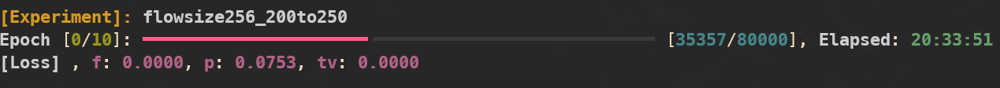

# POSTECH Computer Graphics Lab progress bar
A tool for visualizing your deep learning training progress.

## Key features
- **Colored text** for better legibility
-  **Awesome pbar** equivalent to the latest version of pip
- Visualization on experiment name, losses, elapsed time, ...

## Dependency
This module is only tested on 
- pip >= 22.3
- python >= 3.6

## Screenshot

## Acknowledgements
This repo highly depends on https://github.com/pypa/pip. Thanks for their nice work!
